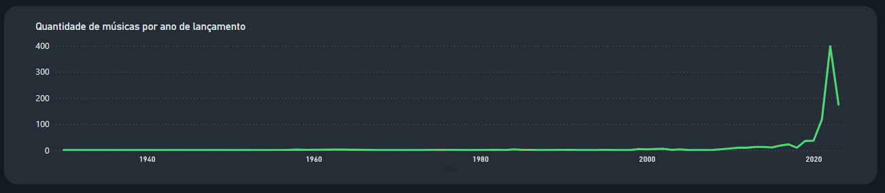
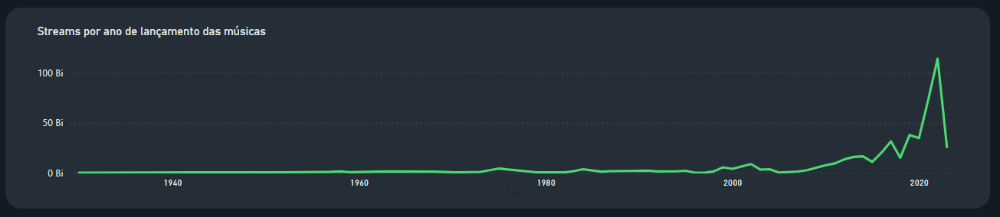
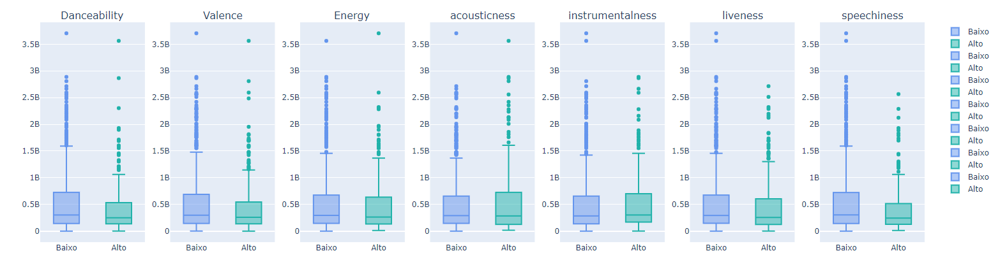
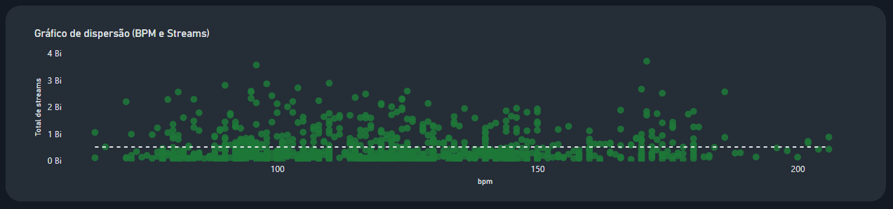
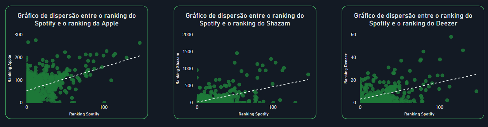
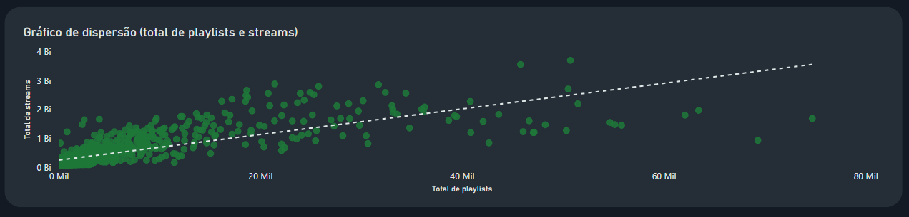
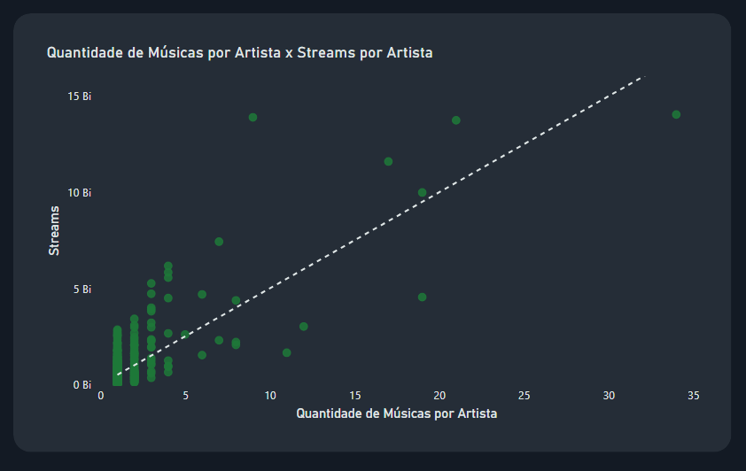
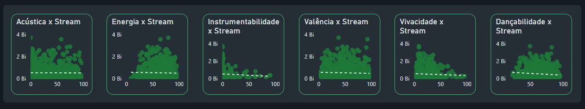
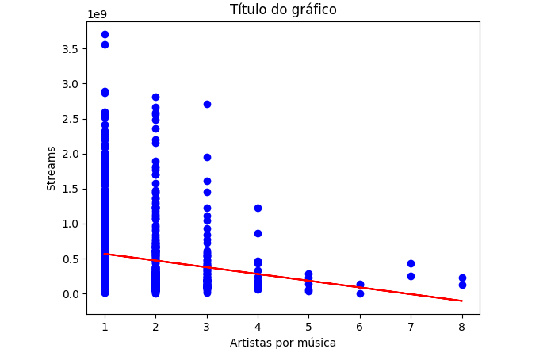

# Ficha técnica | Mix Master

## Índice  
- [Ficha técnica | Mix Master](#ficha-técnica--mix-master)
  - [Índice](#índice)
  - [Equipe](#equipe)
  - [Ferramentas](#ferramentas)
  - [Caso](#caso)
  - [Objetivo](#objetivo)
  - [Dados](#dados)
  - [Google Colab](#google-colab)
  - [Design (Figma)](#design-figma)
  - [Veja o projeto no Power BI](#veja-o-projeto-no-power-bi)
  - [Pré-processamento dos dados](#pré-processamento-dos-dados)
    - [Valores nulos](#valores-nulos)
    - [Valores duplicados](#valores-duplicados)
    - [Valores discrepantes](#valores-discrepantes)
    - [Valores outliers](#valores-outliers)
    - [Novas tabelas](#novas-tabelas)
  - [Conclusões e Validação de Hipóteses](#conclusões-e-validação-de-hipóteses)
    - [Streams por data de lançamento das músicas](#streams-por-data-de-lançamento-das-músicas)
    - [Segmentação](#segmentação)
    - [Hipóteses](#hipóteses)
      - [Hipótese 1 | Será que as músicas com BPM mais alto fazem mais sucesso em termos de número de streams no Spotify? ❌](#hipótese-1--será-que-as-músicas-com-bpm-mais-alto-fazem-mais-sucesso-em-termos-de-número-de-streams-no-spotify-)
      - [Hipótese 2 | As músicas mais populares no ranking do Spotify também possuem um comportamento semelhante em outras plataformas como Deezer? ✅](#hipótese-2--as-músicas-mais-populares-no-ranking-do-spotify-também-possuem-um-comportamento-semelhante-em-outras-plataformas-como-deezer-)
      - [Hipótese 3 | A presença de uma música em um maior número de playlists está correlacionada com um maior número de streams? ✅](#hipótese-3--a-presença-de-uma-música-em-um-maior-número-de-playlists-está-correlacionada-com-um-maior-número-de-streams-)
      - [Hipótese 4 | Artistas com um maior número de músicas no Spotify têm mais streams? ✅](#hipótese-4--artistas-com-um-maior-número-de-músicas-no-spotify-têm-mais-streams-)
      - [Hipótese 5 | As características de uma música influenciam no sucesso em termos de número de streams no Spotify? ❌](#hipótese-5--as-características-de-uma-música-influenciam-no-sucesso-em-termos-de-número-de-streams-no-spotify-)
      - [Hipótese adicional](#hipótese-adicional)
    - [Sugestões](#sugestões)
    - [Limitações e ideias futuras](#limitações-e-ideias-futuras)

## Equipe
Esse projeto foi feito por:
- Eslaine Santos (https://www.linkedin.com/in/eslaine-santos-e-santos-46159a28/)
- Maiully Mendonça (https://www.linkedin.com/in/maiully-data-analyst/)
## Ferramentas
- BigQuery: gerenciamento de dados usando a linguagem SQL.
- Power BI: para visualização de dados.
- Google Colab (Python): para realizar análises colaborativas usando Python.
## Caso
Em um mercado altamente competitivo, uma gravadora precisa inserir um novo artista no cenário global da música.

A gravadora levantou as seguintes hipóteses sobre o que faz com que uma música seja mais ouvida:

- Músicas com BPM (Batidas Por Minuto) mais altos fazem mais sucesso em termos de número de streams no Spotify.
- As músicas mais populares no ranking do Spotify também possuem um comportamento semelhante em outras plataformas, como a Deezer.
- A presença de uma música em um maior número de playlists está correlacionada com um maior número de streams.
- Artistas com um maior número de músicas no Spotify têm mais streams.
- As características da música influenciam o sucesso em termos de número de streams no Spotify.  
## Objetivo
O objetivo desse projeto foi ajudar uma gravadora a lançar um novo artista
no cenário musical global, auxiliando na tomada de decisões baseadas nos
dados, por meio da validação de hipóteses.
## Dados
- Para ter acesso aos dados originais do projeto, acesse a pasta arquivos_originais.  
- Para ter acesso aos dados tratados do projeto, acesse a pasta dados_tratados.
## Google Colab
Acesse o notebook do Google Colab para conhecer os códigos e gráficos gerados para os testes de hipóteses.  
[Clique aqui para acessar](https://colab.research.google.com/drive/119geWP5ptsqI5TKIUUcVjuHzDP8Ym9tK#scrollTo=W51ocgiq-h8Q)
## Design (Figma)  
Nós criamos um projeto no Figma para o guia de estilos do nosso dashboard, pensamos em inspirações, cores, contrastes e na acessibilidade para pessoas com daltonismo e baixa visão.
- Para ver cores, ícones, e o teste de acessibilidade, [acesse o projeto no Figma](https://www.figma.com/file/lfbKCrMl0ygbW2s9fUCsuV/dashboard-hipoteses?type=design&node-id=1104%3A28&mode=design&t=E1pQKO0ufPYp8Q1C-1).
## Veja o projeto no Power BI

[Conheça o nosso dashboard no Power BI](https://app.powerbi.com/view?r=eyJrIjoiYzRiYTJjMTItMTI3MS00NDAzLTk4YmYtYzBjMDQzMmQ1NzQ0IiwidCI6ImRkYWUxY2M0LWJmMjItNGVjNC04ZGVkLWYxMjk3OTI2YmMxNiJ9&pageName=ReportSection566586d215a102c1dbbe)  
## Pré-processamento dos dados
### Valores nulos  
Após as consultas foram encontradas as seguintes contagens para os valores nulos:
- Tabela track_in_competition  
    - Foram encontrados 50 valores nulos na coluna in_shazam_charts. Esses valores não foram eliminamos. Escolhemos substituir os valores nulos pela moda dessa variável. O valor da moda foi escolhido por conta da variabilidade alta dos dados.
- Tabela track_technical_info
  - Foram encontrados 95 valores nulos na coluna key. No caso da variável key, optamos por não adicionar na tabela unida, pois não foi preciso avaliar essa variável.
### Valores duplicados
Optamos por investigar os duplicados das seguintes colunas:
- Tabela track_in_competition: coluna track_id (0 duplicados)
- Tabela track_techical_info: coluna track_id (0 duplicados)
- Tabela track_in_spotify: colunas track_name + artist_s__name (4 duplicados)

A tabela track_in_spotify conta com 4 linhas em que o nome do artista e o nome da música foram duplicados:
- SNAP | Rosa Linn | Duplicada 2 vezes  
- About Damn Time | Lizzo | Duplicada 2 vezes  
- Take My Breath | The Weeknd | Duplicada 2 vezes  
- SPIT IN MY FACE! | ThxSoMch | Duplicada 2 vezes  

Optamos por eliminar essas 4 linhas duplicadas a fim de evitar equívocos na análise.  

### Valores discrepantes  
Na coluna track_name da tabela track_in_spotify, algumas músicas continham o caractere indesejado: �. Esse caractere foi removido.
    
Na coluna streams da tabela track_in_spotify, foi encontrado o valor BPM110KeyAModeMajorDanceability53Valence75Energy69Acousticness7Instrumentalness0Liveness17Speechiness3. A linha que continha esse valor foi removida, pois optamos por usar apenas os valores do tipo numérico.  

### Valores outliers  

Utilizamos gráficos de dispersão para observar a distribuição das variáveis. Concluímos que os valores das variáveis são bastante heterogêneos, contendo vários outliers. Optamos por não excluir esses outliers porque, para a análise do cenário musical, seria importante entender o comportamento desses outliers, já que estes representam (na maioria das variáveis) os artistas que possuem um maior destaque nesse cenário.  

### Novas tabelas  
Foram criadas 3 novas tabelas?  
- Tabela correlation_table: contém dados sobre a correlação entre as variáveis.  
- Tabela total_musics_artist: contém dados sobre o total de músicas por artista, e dados sobre a média de streams por artista.  
- Tabela joined_tables: contém dados sobre as músicas, incluindo nome do artista, data de lançamento, total de playlists nas quais estão inseridas (em diferentes plataformas), ranking em diferentes plataformas, e características técnicas.  

## Conclusões e Validação de Hipóteses
### Streams por data de lançamento das músicas
→ Os dados para essa análise, se tratam das músicas mais ouvidas no ano de 2023. Ao analisar o ano de lançamento das músicas desse banco de dados, é possível observar:

- Músicas com lançamentos antes de 2019: 184
- Músicas com lançamentos depois de 2019: 763

Obs.: É importante ressaltar que os dados utilizados para esta análise constituem uma amostra, o que pode potencialmente limitar algumas conclusões. Atualmente, a plataforma do Spotify abriga um acervo de mais de 100 milhões de faixas [(1)](https://www.notion.so/Refer-ncias-37e342c0ae0f49e8b45b9378ecb685f4?pvs=21).

→ Quanto às músicas mais ouvidas em 2023, segregadas por ano de lançamento e com base em nossa amostragem: 

- Antes de 2019: 201 bilhões de streams
- Depois de 2019: 286 bilhões de streams

→ Quando comparamos os streams por ano de lançamento antes e depois de 2017, a diferença é ainda maior.

- Antes de 2017: Aproximadamente 157 bilhões
- Depois de 2017: Aproximadamente 329 bilhões   
    
→ O gráfico abaixo mostra o total de músicas por ano de lançamento:

→ O gráfico abaixo mostra a quantidade de streams por ano de lançamento da música:

→ Observou-se que as pessoas ouviram mais músicas lançadas nos anos mais recentes, algumas possíveis explicações são:  
- As músicas lançadas atualmente são divulgadas extensivamente em diversas plataformas sociais, o que as mantém por mais tempo nas listas de tendências. Isso pode contribuir significativamente para o aumento do número de streams de faixas lançadas recentemente.
- Também é interessante pensar que atualmente os artistas divulgam os seus lançamentos nas redes sociais e em plataformas da internet, isso pode influenciar para que as músicas lançadas recentemente sejam mais populares.
- A quantidade de músicas que foram lançadas a partir de 2017 é consideravelmente maior do que a quantidade de músicas que foram lançadas em anos anteriores.  

Para resumir essa análise, listamos os dez artistas com mais streams, os dez artistas com mais lançamentos e as dez músicas com mais strems:  

- Top 10 artistas com mais músicas:  
      1. Taylor Swift  
      2. The Weekend  
      3. Bad Bunny  
      4. Sza  
      5. Harry Styles  
      6. Kendrick Lamar  
      7. Morgan Wallen  
      8. Ed Sheeran  
      9. BTS  
      10. Drake, 21 Savage   
 
- Top 10 artistas com mais streams:
      1. Taylor Swift  
      2. Ed Sheeran  
      3. The Weekend  
      4. Harry Styles  
      5. Bad Bunny  
      6. Oliva Rodrigo  
      7. Eminem  
      8. Bruno Mars  
      9. Arctic Monkeys  
      10. Imagine Dragons    

- 10 músicas com mais streams:

    1. BLINDING LIGHTS | The Weekend  
    2. SHAPE OF YOU | Ed Sheeran  
    3. SOMEONE YOU LOVED | Lewis Capald  
    4. DANCE MONKEY | Tones and I  
    5. SUNFLOWER | SPIDER-MAN: INTO THE SPIDER-VERSE | Post Malone, Swae Lee  
    6. ONE DANCE | Drake Wizkid, Kyla  
    7. STAY (WITH JUSTIN BIEBER) | Just Bieber anda, Kid Laroy  
    8. BELIEVER | Imagine Dragons  
    9. CLOSER | The Chainmokers, Halsey  
    10. STARBOY | The Weekend, Daft Punk   

→ 5 dos artistas mais ouvidos, cujo volume de streams é significativo, coincidem com aqueles que têm a maior quantidade de músicas mais ouvidas. Essa observação sugere que os artistas mais populares têm uma presença significativa no top das músicas mais ouvidas. Isso indica que os artistas mais ouvidos tendem a ter um grande número de faixas que se destacam nas listas de tendências. Essa associação entre o sucesso dos artistas e a popularidade de suas músicas pode refletir a capacidade desses artistas de criar conteúdo musical que ressoa com o público e mantém sua relevância nas plataformas de streaming.

→ Adicionalmente, é interessante notar que seis das músicas presentes no top 10 das mais ouvidas são duetos. Isso pode sugerir que colaborações entre artistas, especialmente em formato de duetos, têm potencial para atrair uma audiência significativa e alcançar posições de destaque nas listas de reprodução. Esse fenômeno pode ser atribuído à combinação de diferentes estilos musicais e à curiosidade dos ouvintes em relação à interação entre os artistas envolvidos [(2)](https://www.notion.so/4a4744e08a9f40fdb6948d8c93f3dcce?pvs=21).  

### Segmentação  
📌  Foram realizados testes estatísticos ao segmentar a variável "streams_int" em categorias de alto e baixo, com base nas características das músicas.  

→ Os testes realizados revelaram diferenças estatisticamente significativas para as variáveis Danceability e Speechiness ao segmentar os grupos de streams em categorias de alto e baixo, conforme indicado pelos valores baixos do p-valor [(Veja os testes de hipóteses em nosso notebook)](https://colab.research.google.com/drive/119geWP5ptsqI5TKIUUcVjuHzDP8Ym9tK).

→ No teste de Mann-Whitney, a estatística de teste U é calculada para avaliar se há diferença entre os grupos. Um p-valor menor que 0,05 sugere que a diferença observada não é devida ao acaso e permite rejeitar a hipótese nula. No caso presente, os p-valores foram inferiores a 0,05 para as variáveis Danceability e Speechiness, indicando diferenças estatisticamente significativas entre os grupos.

→ No entanto, é importante destacar que o p-valor não fornece informações sobre a magnitude da diferença entre os grupos, apenas se essa diferença é improvável de ocorrer ao acaso.  

📌 Gráfico Boxplot dos grupos testados:  

  

### Hipóteses

#### Hipótese 1 | Será que as músicas com BPM mais alto fazem mais sucesso em termos de número de streams no Spotify? ❌

Variável Dependente | Variável Independente | Correlação | Nível da correlação
--------------------|-----------------------|------------|--------------------
Streams             |BPM                    | -0.0023061 |Baixa  

  

→ A Hipótese 1 sugere que músicas com um maior número de BPM (Beats Per Minute) tendem a ser mais bem-sucedidas em termos de streams no Spotify. No entanto, não foi identificada uma correlação forte entre essas variáveis.

→ As análises estatísticas, não indicaram uma associação significativa ou consistente entre o BPM de uma música e o seu sucesso em termos de streams no Spotify. Em outras palavras, a velocidade da música, medida em BPM, não parece ter uma influência decisiva na quantidade de streams que ela recebe na plataforma.

#### Hipótese 2 | As músicas mais populares no ranking do Spotify também possuem um comportamento semelhante em outras plataformas como Deezer? ✅

Variável Dependente | Variável Independente | Correlação | Nível da correlação
--------------------|-----------------------|------------|--------------------
Ranking no Spotify  |In_deezer_charts       |0.599986    | Moderada
Ranking no Spotify  |In_apple_charts        |0.551428    | Moderada
Ranking no Spotify  |In_shazam_charts       |0.571838    | Moderada  

  

→ A Hipótese 2 propõe que as músicas mais populares no ranking do Spotify também apresentam um desempenho semelhante em outras plataformas, como o Deezer. Foi identificada uma correlação moderada entre todas as variáveis testadas: in_spotify_charts vs. in_deezer_charts, in_spotify_charts vs. in_apple_charts e in_spotify_charts vs. in_shazam_charts.

→ Isso significa que há uma associação moderada entre a presença de uma música no ranking do Spotify e sua presença no ranking do Deezer, Apple Music e Shazam. Em outras palavras, as músicas que são populares no Spotify tendem a ter uma presença semelhante em termos de popularidade nessas outras plataformas, mas essa associação não é tão forte a ponto de ser considerada altamente correlacionada.

→ Em termos reais, não é possível afirmar categoricamente que uma música que esteja classificada em uma posição alta em um determinado ranking em uma plataforma estará necessariamente bem classificada em outro ranking em outra plataforma. Embora tenha sido identificada uma correlação moderada entre as variáveis testadas, isso indica apenas uma associação estatística entre a presença das músicas nos rankings das diferentes plataformas, não uma relação de causa e efeito.

→ Diversos fatores podem influenciar a popularidade de uma música em cada plataforma, incluindo preferências de público-alvo, estratégias de marketing, algoritmos de recomendação e promoção específica em cada plataforma. Portanto, enquanto pode haver uma tendência geral de que músicas populares em uma plataforma também tenham uma presença significativa em outras, essa relação não é determinística e varia dependendo de diversos contextos e condições específicas de cada plataforma e do comportamento do público.  

#### Hipótese 3 | A presença de uma música em um maior número de playlists está correlacionada com um maior número de streams? ✅

**Dentre as 236 músicas com alto número de streams, sabemos que:**  
→ São músicas com alto número de playlists no Spotify: 196  
→ São músicas com alto número de playlists na Apple: 158  
→ São músicas com alto número de playlists no Deezer: 182  

A análise constatou que músicas presentes em muitas playlists tendem a ter um número maior de streams. Isso é plausível, uma vez que a inclusão frequente de uma música em várias playlists aumenta sua exposição aos usuários, o que pode resultar em um aumento na sua reprodução.  
→ Calculamos a correlação do total de playlists que uma música está inserida em relação ao quanto ela é ouvida (quantidade de streams):  

Variável Dependente | Variável Independente | Correlação | Nível da correlação
--------------------|-----------------------|------------|--------------------
Streams             |Total de playlists     |0.771199    |Alta  

   

A análise revelou uma correlação significativa entre as variáveis total_playlists e streams_int. Como já foi mencionado, esse achado é coerente, uma vez que a frequente inclusão de uma música em diversas playlists expande sua visibilidade junto aos usuários. Ao figurar em um número maior de playlists, uma música se depara com mais oportunidades de ser descoberta e ouvida por um público mais amplo, o que, por sua vez, pode culminar em um notável aumento no número de streams.

Portanto,  a correlação observada entre a quantidade de playlists e o número de streams reforça a ideia de que estratégias que visem aumentar a inclusão de músicas em playlists podem potencializar seu desempenho em termos de streams. Isso pode envolver campanhas de divulgação direcionadas a curadores de playlists [(4)](https://www.notion.so/Refer-ncias-f94127250dea4be999fa02fba2ad4763?pvs=21), colaborações com outros artistas ou influenciadores, promoção cruzada entre plataformas de streaming e a criação de conteúdo envolvente para incentivar a inclusão da música em playlists por parte dos usuários.  

#### Hipótese 4 | Artistas com um maior número de músicas no Spotify têm mais streams? ✅  

Variável Dependente | Variável Independente | Correlação | Nível da correlação
--------------------|-----------------------|------------|--------------------
Streams             |Total de músicas por artista | 0.778368 |Alta  

  

A hipótese 4 sugere que artistas com um maior número de músicas no Spotify acumulam mais streams. Como evidenciado pelo gráfico e pela correlação entre essas variáveis, os artistas que lançam mais músicas tendem a ser mais ouvidos. No início da análise dos resultados, foi observado que cinco dos artistas mais ouvidos também estavam no top 10 de artistas com mais lançamentos.

Essa constatação, juntamente com a análise da correlação entre essas duas variáveis, fortalece a ideia de que os artistas que buscam aumentar sua audiência e obter mais sucesso na carreira musical devem realizar lançamentos frequentes de músicas.  

#### Hipótese 5 | As características de uma música influenciam no sucesso em termos de número de streams no Spotify? ❌  

De forma geral, constatamos que não há uma correlação significativa entre as características das músicas e sua popularidade.  
→ As músicas dos artistas mais ouvidos apresentam uma diversidade considerável em suas características, não permitindo a identificação de um padrão claro.  
Essa conclusão é reforçada pela análise da correlação entre as características da música e sua popularidade, medida pelo total de streams, como evidenciado nos gráficos de dispersão abaixo e suas respectivas correlações:  

Variável Dependente | Variável Independente | Correlação | Nível da correlação
--------------------|-----------------------|------------|--------------------
Streams             |Energia                |-0,026077   |Baixo  
Streams             |Instrumentailidade     |-0,044119   |Baixo  
Streams             |Valência               |-0,040843   |Baixo
Streams             |Speechiness            |-0.112367   |Baixo
Streams             |Dançabilidade          |-0,105555   |Baixo
Streams             |Acústica               |-0,004701   |Baixo
Streams             |Performance ao vivo    |-0,049954   |Baixo  

Para os artistas mais ouvidos, observa-se que algumas correlações apresentam variações. Por exemplo, no caso de Taylor Swift, há um aumento na correlação das variáveis dançabilidade e valência com a quantidade de streams. Similarmente, para Ed Sheeran, é observado um aumento na correlação das variáveis dançabilidade, valência e acústica com o número de streams. Porém, percebe-se que não há um padrão consistente em relação à correlação dessas variáveis, pois para o 3º e o 4º artistas mais ouvidos, não se observa esse mesmo comportamento.  
Em resumo, não ter encontrado uma correlação significativa para a Hipótese 5 indica que não há uma relação estatisticamente relevante entre as características das músicas e sua popularidade em termos de streams no Spotify. Isso sugere que, dentro da amostra analisada, características como dançabilidade, energia, instrumentalidade, acústica, valência e performance ao vivo das músicas não têm um impacto direto ou consistente na quantidade de streams que recebem. 
Isso indica que, embora esses elementos sejam importantes para o estilo e identidade musical de um artista, a popularidade das músicas não parece ser determinada exclusivamente por suas características musicais, e outros fatores podem estar desempenhando um papel mais significativo na determinação do sucesso das faixas.  

#### Hipótese adicional
Testamos uma nova hipótese:  
→ O total de artistas envolvidos em uma música tem relação com o total de streams? ✅  
Para analisar essa hipótese, calculamos a correlação entre o total de artistas por música e o total de streams. O valor de R-pearson e o gráfico de dispersão com sua respectiva regressão indicam uma correlação muito baixa entre essas variáveis:  

Variável Dependente | Variável Independente | Correlação | Nível da correlação
--------------------|-----------------------|------------|--------------------
Streams             |Total de artistas por música |-0.13632 |Baixo  

Entretanto, ao analisar o gráfico abaixo, é possível observar que as músicas com poucos artistas envolvidos na faixa apresentam uma variabilidade considerável. Isso sugere que, para o grupo de músicas com 1 a 3 artistas por música, existem tanto faixas com baixo número de streams quanto faixas com alto número de streams. Por outro lado, no grupo de músicas com 4 artistas por música ou mais, a quantidade de streams tende a ser mais uniformemente baixa.  

  

Essa observação nos leva a concluir que, por algum motivo, canções com muitos artistas por música tendem a não atrair muitos streams. Isso pode ser atribuído a uma série de fatores, como a complexidade da colaboração entre múltiplos artistas, a diluição da identidade musical da faixa ou até mesmo a falta de promoção adequada.  

### Sugestões

• Desenvolver uma Estratégia de Lançamento: Planejar e executar lançamentos regulares de músicas, mantendo uma presença consistente no mercado musical.

• Networking com Curadores de Playlists: Entrar em contato com curadores de playlists relevantes e promover ativamente suas músicas para inclusão em playlists populares.

• Diversificar a Presença em Plataformas: Além do Spotify, considerar a promoção e distribuição da música em outras plataformas de streaming para alcançar um público mais amplo.

• Considerar a diversificação da presença em outras plataformas de streaming além do Spotify, aproveitando a associação moderada entre as diferentes plataformas para expandir o alcance do público.

• Enfatizar a qualidade e autenticidade das músicas, em vez de se concentrar em características específicas que não demonstraram ter um impacto direto na popularidade.

• Explorar oportunidades de colaboração e parceria com outros artistas de forma equilibrada, evitando sobrecarregar as faixas com um número excessivo de colaboradores.  

### Limitações e ideias futuras

Muitos fatores podem influenciar o número de streams, e muitos deles são externos ao Spotify, o que não é possível avaliar devido aos dados serem quase que exclusivamente provenientes dessa plataforma, com apenas algumas outras variáveis provenientes de plataformas de menor destaque como Deezer, Apple e Shazam.  
Por isso, investigar a influência de fatores externos é importante. Como exemplo, podemos considerar o impacto de ouvir um clipe no YouTube ou em outras redes sociais na quantidade de vezes que uma música será reproduzida no Spotify.  
Além disso, restringir os dados apenas às músicas mais ouvidas em um único ano pode limitar a generalização dos resultados, pois não considera a diversidade e a evolução do cenário musical ao longo do tempo.

<b>Obrigada por sua atenção!