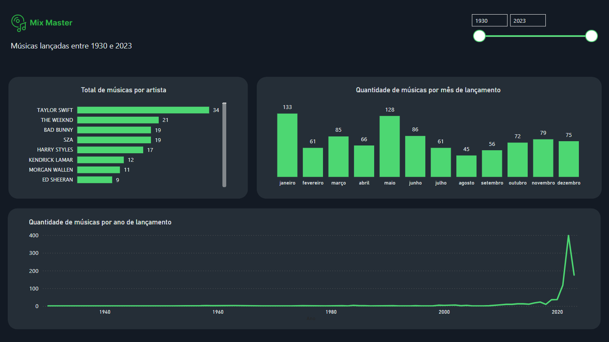

# Ficha técnica | Mix Master

<a href="## Equipe">Equipe</a> •
<a href="## Ferramentas">Ferramentas</a> •
<a href="## Caso">Caso</a> •
<a href="## Objetivo">Objetivo</a> •
<a href="## Dados">Dados</a> •
 •
<a href="## Veja o projeto no Power BI">Power BI</a> •
<a href="## Resultados e Conclusões">Resultados e Conclusões</a> •
<a href="LinkdIn">LinkdIn</a>

  

## Equipe
- Eslaine Santos
- Maiully Mendonça (maiully.mend@gmail.com)
## Ferramentas
- BigQuery (linguagem SQL): para gerenciamento de dados.
- Power BI: para visualização de dados.
- Google Colab (Python): para realizar análises em Python.
## Caso
Em um mercado altamente competitivo, uma gravadora precisa inserir um novo artista no cenário global da música.

A gravadora levantou as seguintes hipóteses sobre o que faz com que uma música seja mais ouvida:

- Músicas com BPM (Batidas Por Minuto) mais altos fazem mais sucesso em termos de número de streams no Spotify.
- As músicas mais populares no ranking do Spotify também possuem um comportamento semelhante em outras plataformas, como a Deezer.
- A presença de uma música em um maior número de playlists está correlacionada com um maior número de streams.
- Artistas com um maior número de músicas no Spotify têm mais streams.
- As características da música influenciam o sucesso em termos de número de streams no Spotify.  
## Objetivo
O objetivo desse projeto foi ajudar uma gravadora a lançar um novo artista
no cenário musical global, auxiliando na tomada de decisões baseadas nos
dados, por meio da validação de hipóteses.
## Dados
- Para ter acesso aos dados originais do projeto, acesse a pasta arquivos_originais.  
- Para ter acesso aos dados tratados do projeto, acesse a pasta dados_tratados.
## Google Colab
Acesse o notebook do Google Coleb para conhecer os códigos e gráficos gerados para os testes de hipóteses.  
[Clique aqui para acessar](https://colab.research.google.com/drive/119geWP5ptsqI5TKIUUcVjuHzDP8Ym9tK#scrollTo=W51ocgiq-h8Q)
## Design (Figma)  
- Para ver inspirações, cores, ícones, e teste de acessibilidade, [acesse o projeto no Figma](https://www.figma.com/file/lfbKCrMl0ygbW2s9fUCsuV/dashboard-hipoteses?type=design&node-id=1104%3A28&mode=design&t=E1pQKO0ufPYp8Q1C-1).
## Veja o projeto no Power BI

[Conheça o nosso dashboard no Power BI](https://app.powerbi.com/view?r=eyJrIjoiZmU2ZTdjZTktYWQyOS00YjcwLTgyNDUtODM3ZmRhMDdiMTQ5IiwidCI6ImUwZjY3ODE5LTJmNmYtNDg0Mi1hZjVlLTA5ZjI4Y2U4N2U0NyJ9)  
## Resultados e Conclusões
Os resultados do projeto foram apresentados e discutidos em uma página pública do Notion. Para saber mais detalhes e descobrir quais hipóteses foram validadas e quais foram refutadas, [clique aqui para acessar a página.](https://www.notion.so/Resultados-e-Conclus-es-dfc2af5e8eef4460ae8428b746c82511) ✌🏽  
### Hipóteses
**Músicas com BPM (Batidas Por Minuto) mais altos fazem mais sucesso em termos de número de streams no Spotify?**  
❌ Não foi identificada uma correlação forte entre essas variáveis.  
  
**A escala musical influencia no número de streams?**  
❌ Não, os valores de streams para cada escala estão bem distribuídos em ambos os grupos.  
  
**As músicas mais populares no ranking do Spotify também possuem um comportamento semelhante em outras plataformas?**  
⭐ Em termos reais, não é possível afirmar categoricamente que uma música que esteja classificada em uma posição alta em um determinado ranking em uma plataforma estará necessariamente bem classificada em outro ranking em outra plataforma. Embora tenha sido identificada uma correlação moderada entre as variáveis testadas, isso indica apenas uma associação estatística entre a presença das músicas nos rankings das diferentes plataformas, não uma relação de causa e efeito. 
   
**A presença de uma música em um maior número de playlists está correlacionada com um maior número de streams?**  
✅ A análise revelou uma correlação significativa entre o total de playlist e o total de streams.   
  
**Artistas com um maior número de músicas no Spotify têm mais streams?**  
⭐ Os artistas que lançam mais músicas tendem a ser mais ouvidos. No início da análise dos resultados, foi observado que cinco dos artistas mais ouvidos também estavam no top 10 de artistas com mais lançamentos.  
  
**O total de artistas envolvidos em uma música tem relação com o total de streams?**  
✅ O grupo de músicas com 1 a 3 artistas, conta com faixas com baixo e alto número de streams. Por outro lado, no grupo de músicas com 4 artistas por música ou mais, a quantidade de streams tende a ser mais uniformemente baixa. Canções com muitos artistas por música tendem a não atrair muitos streams.  
  
**As características da música influenciam o sucesso em termos de streams no Spotify?**  
❌ Não há uma relação estatisticamente relevante entre as características das músicas e sua popularidade em termos de streams no Spotify. Isso sugere que, dentro da amostra analisada, características como dançabilidade, energia, instrumentalidade, acústica e valência das músicas não têm um impacto direto ou consistente na quantidade de streams que recebem. 
   
## Venha nos conhecer!
Quer saber mais sobre as autoras desse projeto? Acesse o nosso LinkedIn:
  
https://www.linkedin.com/in/maiully-data-analyst/
  
https://www.linkedin.com/in/eslaine-santos-e-santos-46159a28/
  
    

<b>Obrigada por sua atenção!